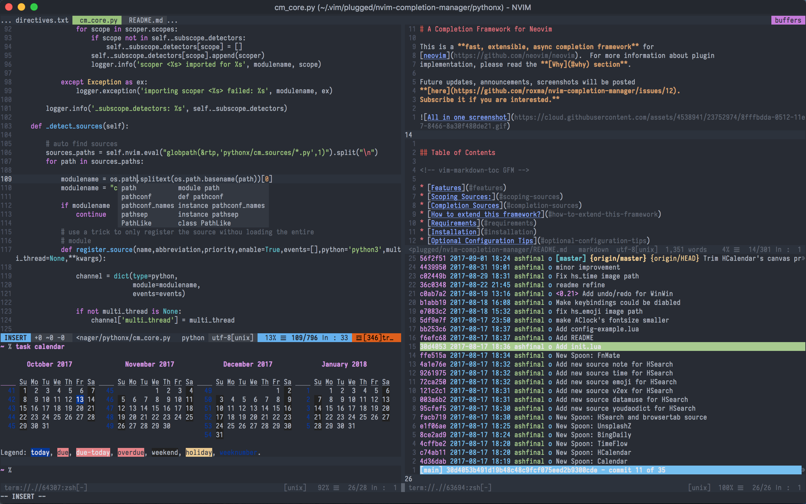

# re-vim: sensible vim configuration

★ Single file, just download it then fire up your nvim/vim!

★ Well polished, should work on Mac, Linux and Windows.

★ Full [Language Server Protocol](https://langserver.org/) support([node.js][node.js] required).

★ Easy to maintain and extend, to fulfill your needs.

## Get started

Download [.vimrc][vimrc] file, put it in your home directory. Run vim as usual, it can handle itself quite well.

Tips for Linux & macOS users(install & update):

    curl -Lo ~/.vimrc https://j.mp/re-vim

Need [neovim](https://github.com/neovim/neovim) support?

    ln ~/.vimrc ~/.config/nvim/init.vim

If on Windows, run these in Command Prompt:

    mkdir "%USERPROFILE%\AppData\Local\nvim"
    mklink "%USERPROFILE%\AppData\Local\nvim\init.vim" "%USERPROFILE%\.vimrc"

## Screenshots

*The screenshot was taken from [VimR](https://github.com/qvacua/vimr).*

Some old screenshots can be found [here](./screenshots/).

## Plugins

re-vim uses [vim-plug](https://github.com/junegunn/vim-plug) (`+python` required) as plugin manager. Run `:PlugInstall` in vim to install all built-in plugins. This should be completed in 30 secs.

### Plugins list

- [delimitMate][delimitMate] - provides insert mode auto-completion for quotes, parens, brackets, etc.
- [vim-easy-align][vim-easy-align] - A Vim alignment plugin
- [goyo.vim][goyo.vim] - Distraction-free writing in Vim
    - [limelight.vim][limelight.vim] - Best served with [goyo.vim][goyo.vim]
- [ultisnips][ultisnips] - The ultimate snippet solution for Vim. Send pull requests to SirVer/ultisnips!(`+python` required)
    - [vim-snippets][vim-snippets] - Source of [ultisnips][ultisnips]
- [emmet-vim][emmet-vim] - emmet for vim: http://emmet.io/
- [vim-textmanip][vim-textmanip] - easy text manipulation for vim
- [vim-table-mode][vim-table-mode] - VIM Table Mode for instant table creation
- [vim-sandwich][vim-sandwich] - The set of operator and textobject plugins to search/select/edit sandwiched textobjects.
- [targets.vim][targets.vim] - Vim plugin that provides additional text objects
- [vim-signature][vim-signature] - Plugin to toggle, display and navigate marks
- [vim-fugitive][vim-fugitive] - A Git wrapper so awesome, it should be illegal
- [nerdcommenter][nerdcommenter] - Vim plugin for intensely orgasmic commenting
- [vim-airline][vim-airline] - lean & mean status/tabline for vim that's light as air
- [undotree][undotree] - The ultimate undo history visualizer for VIM
- [ctrlp.vim][ctrlp.vim] - Active fork of kien/ctrlp.vim—Fuzzy file, buffer, mru, tag, etc finder.
- [codi.vim][codi.vim] - The interactive scratchpad for hackers.
- [vim-one][vim-one] - Adaptation of one-light and one-dark colorschemes for Vim
- [neocomplete][neocomplete] - Next generation completion framework after neocomplcache(`+lua` required)
- [coc.nvim][coc.nvim] - Complete engine and Language Server support for neovim & vim, featured as VSCode([node.js][node.js] required)
- [tagbar][tagbar] - Vim plugin that displays tags in a window, ordered by scope([ctags][ctags] required)
- [vimtex][vimtex] - A modern vim plugin for editing LaTeX files.
- [asyncrun][asyncrun] - Run Async Shell Commands in Vim 8.0 / NeoVim and Output to Quickfix Window

## Key bindings

### Primary key bindings.

    imap jk <Esc>           " Use `jk` to exit Insert Mode
    let mapleader = "\<Space>"         " Use `<Space>` as mapleader

### Commands

use `:W` for sudo writing on Mac & Linux.

use `:Wcolor` for showing highlight group under current cursor

### Move around & Edit

| Key            |      Mode      | Action                                  |
|:---------------|:--------------:|:----------------------------------------|
| `<BS>`         |     Normal     | unhighlight the search result           |
| `[b`           |     Normal     | switch to previous buffer               |
| `]b`           |     Normal     | switch to next buffer                   |
| `<Ctrl>` + `a` | Command/Insert | move the cursor to the begining of line |
| `<Ctrl>` + `e` | Command/Insert | move the cursor to the end of line      |
| `<Ctrl>` + `h` | Command/Insert | move the cursor left by word            |
| `<Ctrl>` + `l` | Command/Insert | move the cursor right by word           |
| `<Ctrl>` + `b` |     Insert     | move the cursor left by char            |
| `<Ctrl>` + `f` |     Insert     | move the cursor right by char           |
| `<Ctrl>` + `j` |     Insert     | move the cursor down by line            |
| `<Ctrl>` + `k` |     Insert     | move the cursor up by line              |
| `<Ctrl>` + `j` |     Visual     | move the current line downward          |
| `<Ctrl>` + `k` |     Visual     | move the current line upward            |
| `<Ctrl>` + `h` |     Normal     | resize the current split window         |
| `<Ctrl>` + `l` |     Normal     | resize the current split window         |
| `<Ctrl>` + `j` |     Normal     | resize the current split window         |
| `<Ctrl>` + `k` |     Normal     | resize the current split window         |

### `<Leader>` key related

| Key              |  Mode  | Action                           |
|:-----------------|:------:|:---------------------------------|
| `<Leader>` + `r` | Normal | Restore last session             |
| `<Leader>` + `n` | Normal | Toggle showing linenumber        |
| `<Leader>` + `s` | Normal | Strip whitespace & blankline EOF |

### Plugins key bindings

| Plugin                           | Key                      |      Mode     | Action                                                    |
|:---------------------------------|:-------------------------|:-------------:|:----------------------------------------------------------|
| [ctrlp.vim][ctrlp.vim]           | `<Leader>` + `o`         |     Normal    | Open CtrlP window                                         |
| [undotree][undotree]             | `<Leader>` + `u`         |     Normal    | Toggle undotree window                                    |
| [nerdcommenter][nerdcommenter]   | `\`                      | Normal/Visual | Toggle comment                                            |
| [nerdcommenter][nerdcommenter]   | `Ctrl` + `\`             | Normal/Visual | CommentSexy                                               |
| [emmet-vim][emmet-vim]           | `,` + `,`                | Insert/Visual | Expand abbr                                               |
| [vim-easy-align][vim-easy-align] | `<Leader>` + `g`         | Normal/Visual | Align with                                                |
| [goyo.vim][goyo.vim]             | `Ctrl` + `w` + `<Space>` |     Normal    | Toggle goyo mode                                          |
| [limelight.vim][limelight.vim]   | `Ctrl` + `w` + `<Enter>` |     Normal    | Toggle limelight mode                                     |
| [ultisnips][ultisnips]           | `<Tab>`                  |     Insert    | Expand snips                                              |
| [ultisnips][ultisnips]           | `<Tab>`                  |     Insert    | Jumpforward                                               |
| [ultisnips][ultisnips]           | `<Shift> + <Tab>`        |     Insert    | Jumpbackward                                              |
| [tagbar][tagbar]                 | `<Leader>` + `b`         |     Normal    | Toggle tagbar window                                      |
| [asyncrun][asyncrun]             | `&`                      |     Normal    | AsyncRun arbitrary command(like `wget http://myfile.zip`) |
| [asyncrun][asyncrun]             | `g&`                     |     Normal    | AsyncRun predefined command with `-strip` option          |

### visual-multi key bindings

| Key                    |      Mode     | Action                                       |
|:-----------------------|:-------------:|:---------------------------------------------|
| `Ctrl` + `n`           | Normal/Visual | select the word under cursor                 |
| `<Leader>` + `A`       | Normal/Visual | select all occurrences of the word/selection |
| `Ctrl` + `<LeftClick>` |     Normal    | add a single cursor at current position      |
| `<Leader>` + `<Space>` | Normal/Visual | add a cursor or create cursors vertically    |
| `Ctrl` + `<Down/Up>`   |     Normal    | create cursors vertically                    |
| `n`/`N`/`[`/`]`        |     Normal    | navigate between cursors/regions             |
| `q`/`Q`                |     Normal    | skip/remove the region under cursor          |

### Language Server Protocol related

| Key |  Mode  | Action              |
|:----|:------:|:--------------------|
| gh  | Normal | show hover document |
| gd  | Normal | coc-definition      |
| gf  | Visual | coc-format-selected |
| gy  | Normal | coc-type-definition |
| gs  | Normal | coc-symbols         |
| go  | Normal | coc-outline         |
| gc  | Normal | coc-diagnostics     |
| gm  | Normal | coc-rename          |
| gr  | Normal | coc-references      |
| gi  | Normal | coc-implementation  |

You need to run `:CocInstall coc-word coc-ultisnips coc-html coc-pyls` or something before using LSP related functions. See [Using coc extensions · neoclide/coc.nvim Wiki · GitHub](https://github.com/neoclide/coc.nvim/wiki/Using-coc-extensions) .

For more key bindings please refer to the plugin's manual.

## Customization

re-vim uses `~/.vim/vimrc.after` (and `~/.vim/vimrc.before`) for your customization.

For example, to override the default colorscheme:

    echo "colorscheme one" >> ~/.vim/vimrc.after

To enable true color support:

    echo "set termguicolors" >> ~/.vim/vimrc.after

To add new plugins, you should create `~/.vim/vimrc.plug`:

    echo "Plug 'altercation/vim-colors-solarized'" >> ~/.vim/vimrc.plug

## Related projects

https://github.com/amix/vimrc

https://github.com/spf13/spf13-vim

[vimrc]:https://raw.githubusercontent.com/ashfinal/vimrc-config/master/.vimrc "https://raw.githubusercontent.com/ashfinal/vimrc-config/master/.vimrc"
[delimitMate]:https://github.com/Raimondi/delimitMate "https://github.com/Raimondi/delimitMate"
[neocomplete]:https://github.com/Shougo/neocomplete.vim "https://github.com/Shougo/neocomplete.vim"
[vim-easy-align]:https://github.com/junegunn/vim-easy-align "https://github.com/junegunn/vim-easy-align"
[goyo.vim]:https://github.com/junegunn/goyo.vim "https://github.com/junegunn/goyo.vim"
[limelight.vim]:https://github.com/junegunn/limelight.vim "https://github.com/junegunn/limelight.vim"
[ultisnips]:https://github.com/SirVer/ultisnips "https://github.com/SirVer/ultisnips"
[vim-snippets]:https://github.com/honza/vim-snippets "https://github.com/honza/vim-snippets"
[emmet-vim]:https://github.com/mattn/emmet-vim "https://github.com/mattn/emmet-vim"
[vim-textmanip]:https://github.com/t9md/vim-textmanip "https://github.com/t9md/vim-textmanip"
[vim-table-mode]:https://github.com/dhruvasagar/vim-table-mode "https://github.com/dhruvasagar/vim-table-mode"
[vim-sandwich]:https://github.com/machakann/vim-sandwich "https://github.com/machakann/vim-sandwich"
[targets.vim]:https://github.com/wellle/targets.vim "https://github.com/wellle/targets.vim"
[vim-signature]:https://github.com/kshenoy/vim-signature "https://github.com/kshenoy/vim-signature"
[vim-fugitive]:https://github.com/tpope/vim-fugitive "https://github.com/tpope/vim-fugitive"
[nerdcommenter]:https://github.com/scrooloose/nerdcommenter "https://github.com/scrooloose/nerdcommenter"
[vim-airline]:https://github.com/bling/vim-airline "https://github.com/bling/vim-airline"
[undotree]:https://github.com/mbbill/undotree "https://github.com/mbbill/undotree"
[ctrlp.vim]:https://github.com/ctrlpvim/ctrlp.vim "https://github.com/ctrlpvim/ctrlp.vim"
[codi.vim]:https://github.com/metakirby5/codi.vim "https://github.com/metakirby5/codi.vim"
[vim-one]:https://github.com/ashfinal/vim-one "https://github.com/ashfinal/vim-one"
[coc.nvim]:https://github.com/neoclide/coc.nvim "https://github.com/neoclide/coc.nvim "
[vimtex]:https://github.com/lervag/vimtex "https://github.com/lervag/vimtex"
[asyncrun]:https://github.com/skywind3000/asyncrun/vim "https://github.com/skywind3000/asyncrun.vim"
[node.js]:https://nodejs.org/en/download/ "https://nodejs.org/en/download/"
[tagbar]:https://github.com/preservim/tagbar "https://github.com/preservim/tagbar"
[ctags]:https://github.com/universal-ctags/ctags "https://github.com/universal-ctags/ctags"
