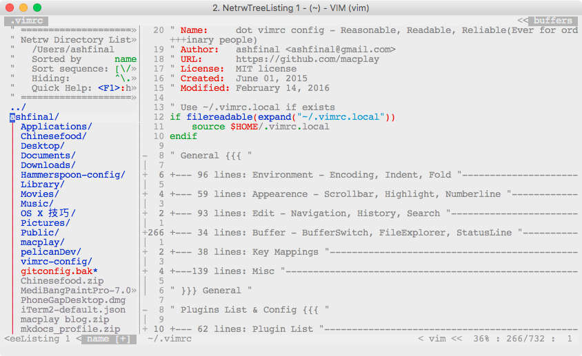

# vimrc-config

dot vimrc config - Reasonable, Readable, Reliable(Ever for ordinary people)

Single file, no installation required. Can be extended easily, and should works on Mac, linux and windows.

## How to use

[Download .vimrc](https://raw.githubusercontent.com/ashfinal/vimrc-config/master/.vimrc) and put it in your home directory. Run vim as usual.

- *nix & Mac

    `curl -o ~/.vimrc https://raw.githubusercontent.com/ashfinal/vimrc-config/master/.vimrc`

- Windows

    You will figure it out. :D

## Read it online

Read the [.vimrc](http://macplay.github.io/attachment/vimrc.html/) file and take what you need.

## Maximize the power

[Read the article](http://macplay.github.io/cool-software/share-my-dot-vimrc-config/)
